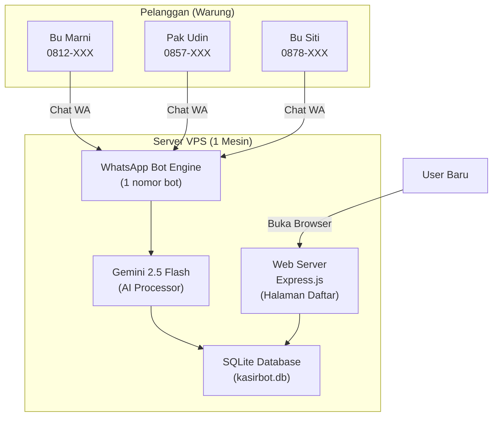

# 🚀 Implementasi: KasirBot SaaS — Multi-Tenant WhatsApp Cashier

## Ringkasan Proyek

Mengubah bot kasir WA single-user menjadi **platform SaaS multi-tenant**: satu nomor WhatsApp bot melayani banyak pelanggan warung/UMKM secara bersamaan. Web hanya untuk pendaftaran, penggunaan harian 100% via WhatsApp.

### Target Pasar
- Warung Madura, toko kelontong, warung kopi kecil
- Gaptek, males ribet, sensitif data
- Sudah pakai WhatsApp sehari-hari

### Alur Pengguna

```
┌──────────────────────────────────────────────────────┐
│                  ALUR PENDAFTARAN (1x)                │
│                                                      │
│  1. Buka web kasirbot → Isi Nama Toko + No HP        │
│  2. Web bilang: "Kirim HALO ke 0821-XXXX-XXXX"       │
│  3. User kirim HALO ke bot                           │
│  4. Bot: "Selamat datang Bu Marni! KasirBot aktif!"  │
└──────────────────────────────────────────────────────┘

┌──────────────────────────────────────────────────────┐
│              PENGGUNAAN HARIAN (via WA)               │
│                                                      │
│  User: "jual rokok surya 2bks 40rb"                  │
│  Bot:  "✅ Pemasukan Rp40.000. Stok surya -2 pcs"    │
│                                                      │
│  User: "laporan hari ini"                            │
│  Bot:  "══ WARUNG MADURA BU MARNI ══                 │
│         Pemasukan:  Rp 540.000                       │
│         Pengeluaran: Rp 100.000 ..."                 │
└──────────────────────────────────────────────────────┘
```

---

## User Review Required

> [!IMPORTANT]
> **Proyek ini akan membuat FOLDER BARU** (`C:\bot-kasir-saas\`) terpisah dari bot lama Anda (`C:\bot-kasir-wa\`). Bot lama Anda **TETAP AMAN dan berjalan** seperti biasa. Kita tidak akan menghapus atau mengubah apa pun di folder lama.

> [!WARNING]
> **Database berubah total** — dari file JSON per-user menjadi 1 database SQLite terpusat. Ini wajib agar multi-tenant bisa berjalan efisien. Semua data pelanggan tersimpan dalam 1 file `kasirbot.db`.

> [!IMPORTANT]
> **Nomor Bot WhatsApp** — Anda perlu menyiapkan 1 nomor HP baru khusus untuk bot SaaS ini. Nomor ini yang akan disimpan oleh semua pelanggan Anda. Tidak bisa pakai nomor pribadi Anda (karena bot akan membalas semua orang yang mengirim pesan).

---

## Arsitektur Sistem



---

## Proposed Changes

### Struktur Folder Baru

```
C:\bot-kasir-saas\
├── config.js              ← ⚙️ Pengaturan global (API Key, nomor bot)
├── server.js              ← 🧠 Otak utama: Express + WhatsApp Bot
├── database.js            ← 💾 Layer database SQLite (CRUD operations)
├── public/                ← 🌐 File web (HTML/CSS/JS)
│   ├── index.html         ← Landing page + form pendaftaran
│   ├── style.css          ← Styling mobile-friendly
│   └── app.js             ← Frontend logic
├── package.json           ← 📦 Dependencies
├── kasirbot.db            ← 💾 Database SQLite (auto-generated)
└── PANDUAN_INSTALASI.md   ← 📖 Dokumentasi
```

---

### Komponen 1: Config (`config.js`)

#### [NEW] [config.js](file:///C:/bot-kasir-saas/config.js)
Konfigurasi global untuk seluruh sistem. Mirip versi lama tapi disesuaikan multi-tenant:

```javascript
module.exports = {
    // Nomor WA BOT (bukan nomor admin, tapi nomor khusus bot)
    NOMOR_BOT: '6281234567890',
    
    // Gemini AI
    GEMINI_API_KEY: 'isi-api-key',
    
    // Port web
    PORT: 3000,

    // Timezone
    TIMEZONE: 'Asia/Jakarta',
    
    // Jam laporan otomatis
    JAM_LAPORAN: '00:00',

    // Path Chrome (untuk whatsapp-web.js)
    CHROME_PATH: 'C:\\Program Files\\Google\\Chrome\\Application\\chrome.exe',
    
    // Masa trial (hari)
    TRIAL_DAYS: 7
};
```

---

### Komponen 2: Database (`database.js`)

#### [NEW] [database.js](file:///C:/bot-kasir-saas/database.js)
SQLite database layer dengan 3 tabel utama:

| Tabel | Kolom | Fungsi |
|---|---|---|
| `users` | `phone`, `store_name`, `owner_name`, `status`, `created_at`, `trial_end` | Data registrasi pelanggan |
| `transactions` | `id`, `user_phone`, `tipe`, `jumlah`, `ket`, `tanggal`, `created_at` | Transaksi masuk/keluar per user |
| `stock` | `id`, `user_phone`, `nama_barang`, `satuan`, `qty` | Stok barang per user |

**Fungsi-fungsi utama:**
- `registerUser(phone, storeName, ownerName)` — Daftar user baru + set trial 7 hari
- `getUser(phone)` — Ambil data user dari nomor HP
- `addTransaction(phone, tipe, jumlah, ket)` — Catat transaksi
- `getTransactions(phone, date?)` — Ambil transaksi (hari ini / semua)
- `updateStock(phone, namaBarang, satuan, aksi, qty)` — Tambah/kurangi stok
- `getStock(phone)` — Ambil semua stok milik user
- `getSaldo(phone)` — Hitung saldo berjalan
- `resetHarian(phone)` — Hapus transaksi hari ini
- `resetTotal(phone)` — Hapus semua data user

**Isolasi data:**
Setiap query menggunakan `WHERE user_phone = ?` sehingga Bu Marni **tidak mungkin** melihat data Pak Udin.

---

### Komponen 3: Bot WhatsApp Multi-Tenant (`server.js`)

#### [NEW] [server.js](file:///C:/bot-kasir-saas/server.js)
File utama yang menggabungkan Express web server + WhatsApp bot engine.

**Perbedaan Utama vs Bot Lama:**

| Aspek | Bot Lama (`index.js`) | Bot Baru (`server.js`) |
|---|---|---|
| Siapa yang boleh chat | Hanya nomor admin (self-chat) | Siapa saja yang sudah terdaftar |
| Filter pesan | `msg.fromMe` + self-chat detection | `getUser(msg.from)` → cek database |
| Data disimpan di | `keuangan.json` (1 file global) | SQLite per-user via `user_phone` |
| Prompt AI | Hardcode "Toko Kelontong" | Dinamis: nama toko & owner dari database |
| Web server | Hanya QR code viewer | Landing page + form daftar + QR |

**Alur Pemrosesan Pesan:**

```
Pesan masuk dari 0812-XXX
       │
       ▼
Cek: Apakah nomor 0812-XXX terdaftar di database?
       │
       ├── TIDAK → Balas: "Hai! Anda belum terdaftar. 
       │            Daftar dulu di kasirbot.com ya!"
       │
       └── YA → Ambil data user (nama toko, saldo, stok)
                 │
                 ▼
           Kirim ke Gemini AI dengan konteks:
           "Anda adalah KasirBot untuk WARUNG MADURA BU MARNI.
            Saldo: Rp540.000. Stok: ..."
                 │
                 ▼
           Proses response AI:
           - Insert transaksi → database (WHERE user_phone)
           - Update stok → database (WHERE user_phone)
           - Kirim reply ke user
```

**Fitur Pendaftaran via WA (alternatif):**
Jika ada user yang langsung chat bot tanpa daftar di web:
```
User  : "DAFTAR Warung Madura Bu Marni"
Bot   : "✅ Selamat datang Bu Marni! Warung Madura sudah terdaftar.
         Masa trial 7 hari dimulai dari sekarang.
         Langsung aja chat saya untuk mencatat jualan ya! 🙏"
```

---

### Komponen 4: Web Frontend (`public/`)

#### [NEW] [index.html](file:///C:/bot-kasir-saas/public/index.html)
Landing page mobile-first yang sangat simpel:

**Konten halaman:**
1. **Hero section** — "KasirBot: Asisten Toko WhatsApp Berbasis AI"
2. **Form pendaftaran** — Hanya 3 field:
   - Nama Toko
   - Nama Pemilik
   - Nomor WhatsApp
3. **Tombol DAFTAR** → Kirim data ke API → Tampil sukses + nomor bot
4. **Panduan singkat** — "Simpan nomor ini, kirim HALO, selesai!"

**Design:** Dark theme modern, glassmorphism, mobile-friendly, animasi halus.

#### [NEW] [style.css](file:///C:/bot-kasir-saas/public/style.css)
Responsive CSS mobile-first.

#### [NEW] [app.js](file:///C:/bot-kasir-saas/public/app.js)
Frontend JavaScript untuk handle form submission via fetch API.

---

### Komponen 5: Dependencies (`package.json`)

#### [NEW] [package.json](file:///C:/bot-kasir-saas/package.json)

| Package | Fungsi |
|---|---|
| `express` | Web server |
| `better-sqlite3` | Database SQLite (sinkron, cepat) |
| `whatsapp-web.js` | WhatsApp bot engine |
| `@google/generative-ai` | Gemini AI |
| `moment-timezone` | Waktu WIB |
| `node-cron` | Laporan otomatis |
| `qrcode-terminal` | QR di terminal |
| `qrcode` | QR di web browser |
| `cors` | Cross-origin untuk API |

---

## Fitur Detail

### 1. Pendaftaran User Baru
- **Via Web:** Isi form → data masuk database → status `trial`
- **Via WA:** Kirim `DAFTAR [Nama Toko] [Nama Owner]` → bot register otomatis
- **Trial 7 hari** gratis, setelah itu status jadi `expired` (bisa Anda extend manual)

### 2. Keamanan & Isolasi Data
- Setiap query database di-filter `WHERE user_phone = ?`
- User A tidak bisa mengakses data user B
- Nomor yang belum terdaftar tidak bisa menggunakan bot

### 3. Laporan Otomatis (Cron)
- Setiap jam yang diatur di config, bot mengirim laporan ke **SEMUA user aktif**
- Loop: ambil semua user aktif → generate laporan per user → kirim via WA

### 4. Manajemen Status User
| Status | Bisa Pakai Bot? | Keterangan |
|---|---|---|
| `trial` | ✅ | 7 hari pertama gratis |
| `active` | ✅ | Sudah bayar langganan |
| `expired` | ❌ | Trial habis / belum perpanjang |
| `banned` | ❌ | Diblokir oleh Anda |

### 5. Admin Panel (Anda Sebagai Owner Sistem)
- Chat khusus dari nomor Anda ke bot bisa menjalankan perintah admin:
  - `ADMIN LIST` → Lihat semua user terdaftar
  - `ADMIN ACTIVATE 08xxxx` → Aktifkan langganan user
  - `ADMIN BAN 08xxxx` → Blokir user
  - `ADMIN STATS` → Total user, revenue, dll

---

## Open Questions

> [!IMPORTANT]
> **Nomor Bot:** Apakah Anda sudah punya nomor HP khusus untuk bot SaaS ini? Atau mau pakai nomor yang sekarang (6282159895420)? Saya sarankan beli nomor baru karena bot akan membalas SEMUA orang yang mengirim pesan.

> [!IMPORTANT]
> **Domain Web:** Apakah Anda sudah punya domain (misal kasirbot.id)? Untuk tahap awal, kita bisa mengaksesnya lewat IP VPS langsung (http://IP-VPS:3000). Domain bisa ditambahkan nanti.

> [!IMPORTANT]
> **Folder Proyek:** Saya akan membuat folder baru `C:\bot-kasir-saas\` terpisah dari bot lama Anda. Bot lama di `C:\bot-kasir-wa\` TIDAK akan disentuh. Setuju?

---

## Verification Plan

### Automated Tests
1. **Database test** — Jalankan script tes: register user, tambah transaksi, cek isolasi data antar user
2. **Bot test** — Kirim pesan dari 2 nomor berbeda, pastikan data tidak bocor
3. **Web test** — Buka halaman daftar di browser, submit form, cek database

### Manual Verification
1. Daftar via web → kirim HALO ke bot → pastikan bot mengenali
2. Catat transaksi dari user A → pastikan user B tidak terpengaruh
3. Tes laporan otomatis → pastikan setiap user dapat laporan masing-masing
4. Tes user yang belum terdaftar → pastikan ditolak sopan
5. Tes perintah admin (LIST, ACTIVATE, BAN)

---

## Estimasi Waktu Pengerjaan

| Tahap | Komponen | Estimasi |
|---|---|---|
| 1 | Config + Database layer | 10 menit |
| 2 | Server.js (Bot multi-tenant + Web) | 30 menit |
| 3 | Frontend web (Landing + Form daftar) | 15 menit |
| 4 | Admin commands | 10 menit |
| 5 | Testing & debugging | 15 menit |
| | **Total** | **~1-1.5 jam** |
